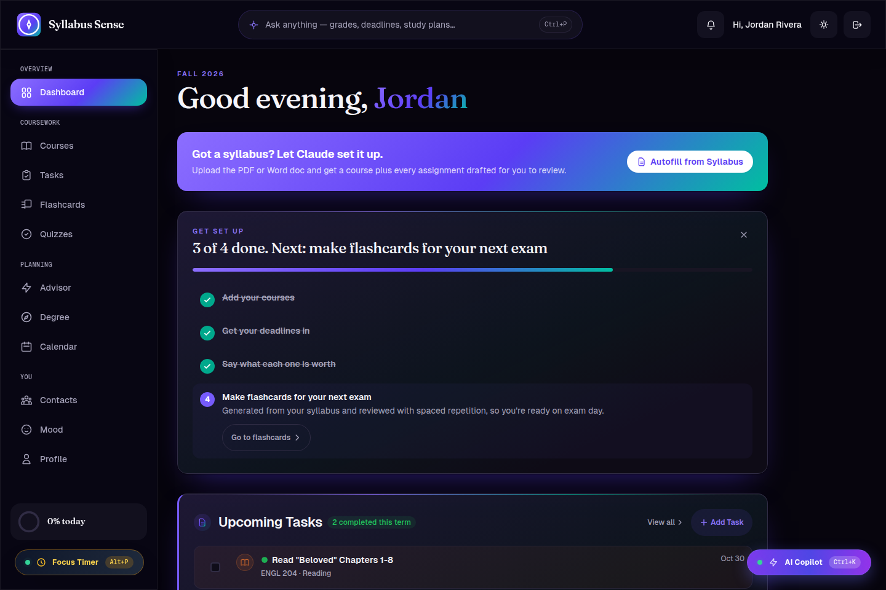
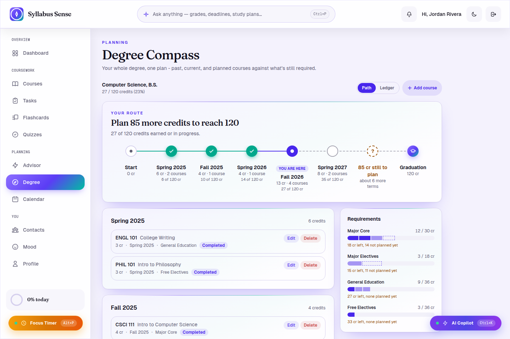
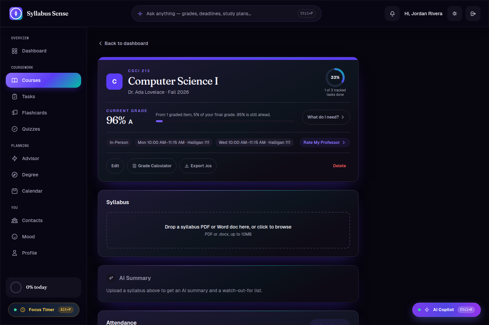

# Syllabus Sense

Upload a syllabus PDF and Claude turns it into a working semester: courses, every assignment on the calendar, grading weights, and a live grade projection — reviewed and editable before anything is trusted.

**Live demo:** [syllabus-sense.vercel.app](https://syllabus-sense.vercel.app)

<p>
  
</p>
<p>
  
  
</p>

## What it does

**Syllabus AI, not a form.** Drop in a PDF or Word syllabus and Claude extracts the course, every assignment with its due date and grade weight, the grading scale, attendance policy, and materials list — surfaced for review with per-field confidence flags before anything is saved. A follow-up chat lets you correct or refine the draft in plain English instead of hunting through form fields.

**Grades that move as you work.** Every course tracks a live weighted grade from the tasks you've completed, shows exactly what's needed on what's left ("What do I need?"), and a what-if grade simulator lets you test hypothetical scores before an exam.

**Degree Compass.** A whole-degree view — one route from your first completed course to graduation, requirement categories tracked against credits earned/in-progress/planned, editable as your program changes.

**Study tools generated from what you already uploaded.** Flashcards with spaced repetition, practice quizzes, and day-by-day cram plans, all built from the actual syllabus content instead of generic material.

**An AI Advisor that only knows your real policies.** Chat about deadlines, workload, or "can I still get an A" grounded in your actual syllabi and grades — it won't invent a late policy that isn't written down.

**The rest of the semester, tracked.** Tasks and a calendar with recurring-item awareness, a workload/burnout radar from your own pace, mood check-ins, a Focus/Pomodoro timer with streaks, contacts for professors and TAs (with office hours and a vCard export), and one-click data export.

## Stack

- **Next.js 14** (App Router) + **TypeScript**, **Tailwind CSS**
- **Firebase** — Auth, Firestore, Storage, with the Local Emulator Suite for offline development
- **Claude** (Anthropic API) — syllabus extraction, chat, summarization, flashcards/quizzes/cram plans, all through a single structured tool-use pipeline with a shared per-user daily usage cap
- **Recharts**, **Zod**, **Vitest** + **Testing Library** (900+ unit tests), **Playwright** (e2e)
- Deployed on **Vercel**, with GitHub Actions running lint/build/test on every PR and auto-deploying Firestore rules on merge to `main`

## Quickstart

```bash
git clone https://github.com/George-T83/Syllabus-Sense.git
cd Syllabus-Sense
npm install
cp .env.example .env.local   # fill in your own Firebase + Anthropic keys
npm run dev
```

Open [http://localhost:3000](http://localhost:3000).

To run entirely offline against the Firebase Local Emulator Suite instead of a real project:

```bash
npm run emulators                            # in one terminal
NEXT_PUBLIC_USE_FIREBASE_EMULATOR=true npm run dev   # in another
```

### Checks

```bash
npm run lint    # ESLint
npm run test    # Vitest unit tests
npm run build   # production build
npm run test:e2e   # Playwright, against a running dev server
```

## Environment strategy

One Firebase project serves every environment, isolated via Firestore's multi-database feature rather than separate projects:

| Environment         | Firestore database                     |
| ------------------- | -------------------------------------- |
| Production (`main`) | `(default)`                            |
| Preview / staging   | `staging`                              |
| Local dev           | `staging`, or the Local Emulator Suite |

Firestore security rules deploy automatically on every merge to `main` that touches `firestore.rules` or `firestore.indexes.json` — see `.github/workflows/deploy-firestore-rules.yml`.

See [`.env.example`](./.env.example) for the full list of required environment variables.
